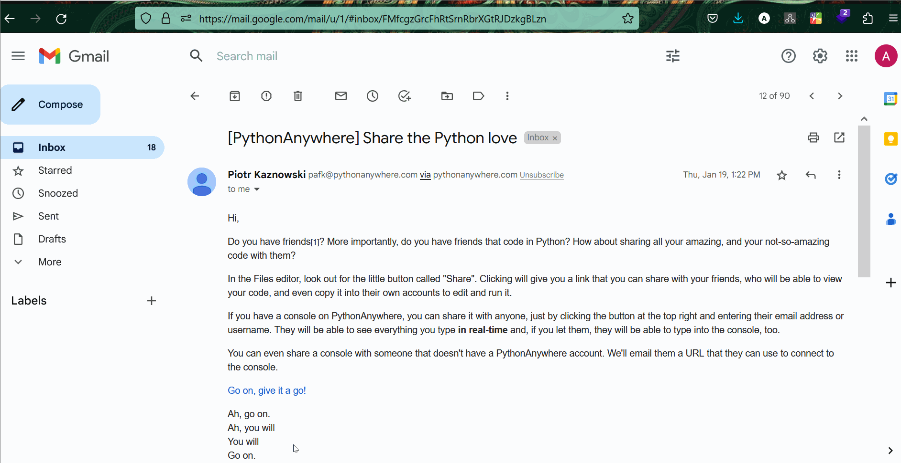
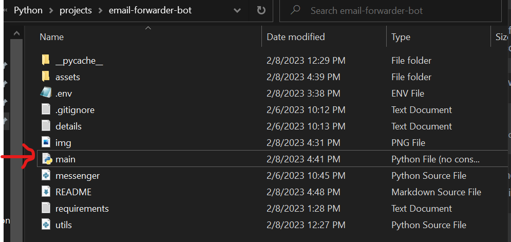
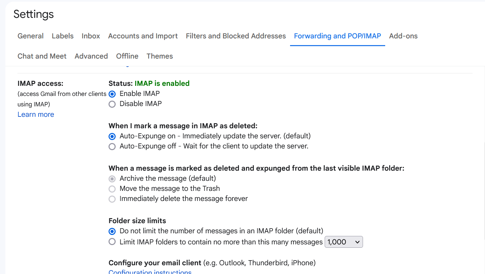
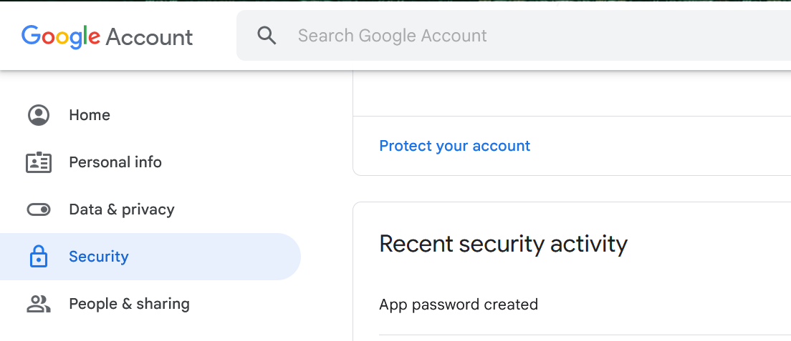

Automatically check once everyday and forward incoming email messages from one email address to 
another.

Tested with **windows** and python version >=3.6.

## Table of Contents
- [Solution Walkthrough](#solution-walkthrough)
- [How to use](#how-to-use)
    - [Gmail Users](#gmail-users)

## Solution Walkthrough


## How to use
- Firstly clone this repository using this command:
```commandline
git clone https://github.com/Josh-Ay/email-forwarder-bot.git
```
- Open up the cloned local copy using your favorite text editor or IDE.
- Install all requirements found in the `requirements.txt` file.
- Go to the .env file and update te dummy details there
```text
EMAIL_ADDRESS=dummyemail@email.com
PASSWORD=dummy
INCOMING_MAIL_ADDRESS=dummyemail@email.com
RECIPIENT_MAIL_ADDRESS=dummyemail@email.com
```
- Navigate to the `main.py` file.
- Update line 15 to reflect the email you are currently using.
```python
# line 15
user_mailbox = "gmail"
```
- In case you only want to forward incoming emails that have a specific subject, you
can replace the `None` in line 18 to reflect that subject
```python
# line 18
email_subject = None
```
For example, if there is a promotional email from your data provider that comes into your 
inbox every 2 days with a subject of `100% Data Bonus` and you would like to forward that 
to a friend, line 18 would become:
```python
# line 18
email_subject = "100% Data Bonus"
```

- Update line 21 to reflect the time you would like this bot to check for incoming mails
```python
# line 21
time_to_check_mail = "15:00"
```
- Save all changes and close your code editor/IDE.
- For gmail users, please read [this](#gmail-users) before continuing.
- Navigate to where this project is stored in your system.
- Click on the ``main.pyw`` file

- That is all. The bot would run in the background every day at the time you have specified. 

Happy Hacking!

### Gmail Users
#### If you are using gmail, you have to
1. Firstly enable IMAP access for your email address

2. Secondly create an app password for your google account. You can find this by:
   - Clicking on 'Manage your google account'
   - Navigate to the 'Security' tab
   - Then create a app password
   
3. Replace the password you set in the `.env` file with the new app password created
